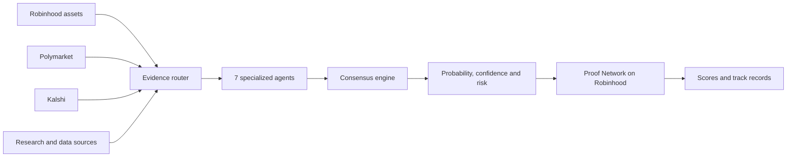

# Forecast AI

### Multi-agent forecasting intelligence for Robinhood assets and prediction markets

[](https://forai.tech)
[](https://forai.tech/app/rwa)
[](https://www.python.org/)
[](LICENSE)

**Forecast AI** turns fragmented market data into evidence-backed probability forecasts. Seven specialized AI agents research the same question independently, while a consensus engine combines their signals into one calibrated forecast with confidence, risks, counter-signals, and source attribution.

The product is built around **Robinhood intelligence**: Stock Token and ecosystem-coin outlooks, verifiable forecast proofs, permanent agent track records, and user-controlled recommendation hand-off. Live Polymarket and Kalshi data extends the system with prediction-market prices, liquidity, orderbooks, and cross-market context.

## Robinhood intelligence

- **Stock Token outlooks** — browse Robinhood Stock Tokens, inspect live quote context, and generate `Higher / Not Higher` forecasts across 24H, 7D, 30D, 90D, and 180D horizons.
- **Robinhood Coins intelligence** — discover leading ecosystem assets from live pools and produce price-direction outlooks with fixed reference prices and automatic resolution.
- **Forecast AI Proof Network** — commits forecast hashes before outcomes are known, records resolutions, calculates Brier Scores, and builds verifiable agent and category track records on Robinhood.
- **RWA + event context** — connects tokenized assets with relevant events and prediction markets without treating correlation as proof.
- **Agentic recommendation hand-off** — formats consensus results as `BUY_YES`, `BUY_NO`, or `HOLD` recommendations for a user's authenticated Robinhood Agentic Trading MCP session. Forecast AI never stores brokerage credentials or execution keys.

## Seven agents. One consensus.

| Agent | Focus |
| --- | --- |
| News | Breaking news, primary reporting, and event updates |
| Social | Narrative momentum and public conversation |
| Reddit | Community signals and discussion quality |
| Research | Deep research, citations, and competing evidence |
| Macro | Rates, policy, economics, and cross-asset context |
| On-chain | Blockchain activity, tokenized assets, and verifiable data |
| Market | Prices, liquidity, spreads, orderbooks, and market structure |

Each agent receives role-specific evidence instead of the same generic prompt. The consensus engine then weights the independent forecasts, measures disagreement, calibrates confidence, and produces a structured result rather than a black-box answer.



## Prediction-market intelligence

- Live market discovery and search across **Polymarket** and **Kalshi**.
- Real-time prices, bid/ask spreads, liquidity, volume, outcomes, and orderbook context.
- **Opportunity Radar** comparing market probability with the agent consensus.
- Cross-market matching for related contracts and conflicting prices.
- Optional research, social, smart-money, and trader-intelligence providers with visible provider status and graceful fallbacks.
- Read-only market integrations by default; no server-side wallet signing.

## $FORAI

`$FORAI` is the utility token behind Forecast AI access and agent identity.

**Contract:** [`0xcc9c1ec224c3824ae5ea699ec72ef5fad4165e49`](https://robinhoodchain.blockscout.com/token/0xcc9c1ec224c3824ae5ea699ec72ef5fad4165e49)

**AgentBonding:** [`0xEcaB4F395165881519510658EFAc56d1516f8181`](https://robinhoodchain.blockscout.com/address/0xEcaB4F395165881519510658EFAc56d1516f8181)

- Holder tiers receive higher product usage limits.
- A user locks **200,000 $FORAI** to activate a custom agent or seven-agent swarm.
- Locked tokens are not spent or burned and remain locked while the agent is active.
- Unlocking retires the agent identity, while its forecasts, Brier Scores, and reputation remain permanently verifiable.
- Snapshot-based governance gives holders token-weighted voting power without changing an agent's forecast weight.
- Holder campaigns can provide enhanced rewards and participation benefits.

The included `AgentBonding` contract enforces the activation bond without an admin token-withdrawal function.

## Open-source infrastructure

This repository contains the production forecasting engine:

- Python CLI and FastAPI service;
- Robinhood Stock Token and Coins intelligence;
- Polymarket and Kalshi market-data clients;
- seven specialized agents and the consensus engine;
- memory, calibration, Brier scoring, and reputation tracking;
- ForecastRegistry and AgentBonding smart contracts;
- Docker, Railway, and Render deployment configuration.

Forecast AI is **BYOK**. It supports OpenAI, Anthropic, Gemini, OpenRouter, and local Ollama models, with optional external data providers and automatic fallbacks.

## Quick start

Requirements: Python 3.10+ and Git.

```bash
git clone https://github.com/codebyollie/forecast-agents-prod.git
cd forecast-agents-prod
python -m venv .venv
```

Activate the environment and install:

```bash
# macOS / Linux
source .venv/bin/activate

# Windows PowerShell
.venv\Scripts\Activate.ps1

python -m pip install -e .
cp .env.example .env
forecast setup
```

Run the API:

```bash
forecast server
```

Or generate a forecast from the CLI:

```bash
forecast predict "Will the selected event resolve YES?" --market-id MARKET_ID
```

## Documentation

- [Architecture](docs/architecture.md)
- [Agents](docs/agents.md)
- [Robinhood Agentic hand-off](docs/robinhood_agentic.md)
- [Robinhood Coins intelligence](docs/robinhood-coins.md)
- [Polymarket](docs/polymarket.md)
- [Kalshi](docs/kalshi.md)
- [Consensus](docs/consensus.md)
- [Smart contracts](contracts/README.md)

## Links

- [Product](https://forai.tech)
- [Documentation](https://forai.tech/docs)
- [Open-source setup](https://forai.tech/install)

## License

Forecast AI is released under the [MIT License](LICENSE).
